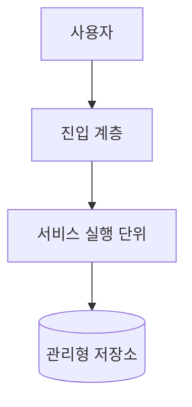

# 배포 구조

## 문서 목적

환경, 실행 노드, 네트워크 경계와 배포 단위의 정적인 구조를 설명합니다. 실제 실행 명령과 승인 절차는 운영 문서에 둡니다.

## 언제 수정하는가

- 환경, 리전, 네트워크 경계 또는 실행 플랫폼이 바뀔 때
- 배포 단위, 복제, 확장 또는 고가용성 방식이 바뀔 때
- 복구 목표나 주요 관리형 서비스가 달라질 때

## 작성할 내용

- 환경별 목적과 차이
- 실행 노드와 배포 단위의 배치
- 네트워크 및 신뢰 경계
- 확장, 가용성, 복구 목표

## 최소 예제

| 환경 | 목적 | 접근 정책 | 데이터 정책 |
|---|---|---|---|
| 개발 | 로컬 개발과 검증 | 개발자 | 비운영 데이터 |
| 검증 | 통합 검증 | 제한된 팀 | 익명화 또는 합성 데이터 |
| 운영 | 실제 서비스 | 최소 권한 | 운영 정책 준수 |

## 배포 단위

## 확장과 가용성

복제 수, 자동 확장 기준, 장애 영역, 복구 목표를 작성합니다.

C4 Deployment Diagram은 기본 템플릿 범위에 포함하지 않습니다. 필요하면 이 문서에 배포 관점의 Mermaid 다이어그램을 추가합니다.

## 관련 문서

- [구성 요소](building-blocks.md)
- [품질](quality.md)
- [배포 및 되돌리기 절차](../operations/deployment.md)
- [장애 대응](../operations/incident-response.md)
