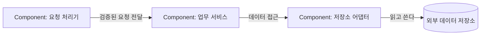

# C4 Component Diagram

## 문서 목적

복잡한 Container 하나의 내부 주요 구성 요소와 상호작용을 선택적으로 보여줍니다. 코드 클래스나 함수 수준은 다루지 않습니다.

## 언제 수정하는가

선택한 Container의 주요 책임 분리, 내부 인터페이스 또는 의존 방향이 바뀔 때 수정합니다. 단순한 Container에는 이 문서를 작성하지 않아도 됩니다.

## 작성할 내용

- 다이어그램 대상 Container의 이름
- 주요 Component와 책임
- 내부 의존 방향과 외부 Container 관계

## 최소 예제

## 관련 문서

- [구성 요소](../../building-blocks.md)
- [C4 Container](container.md)
- [C4 안내](README.md)
