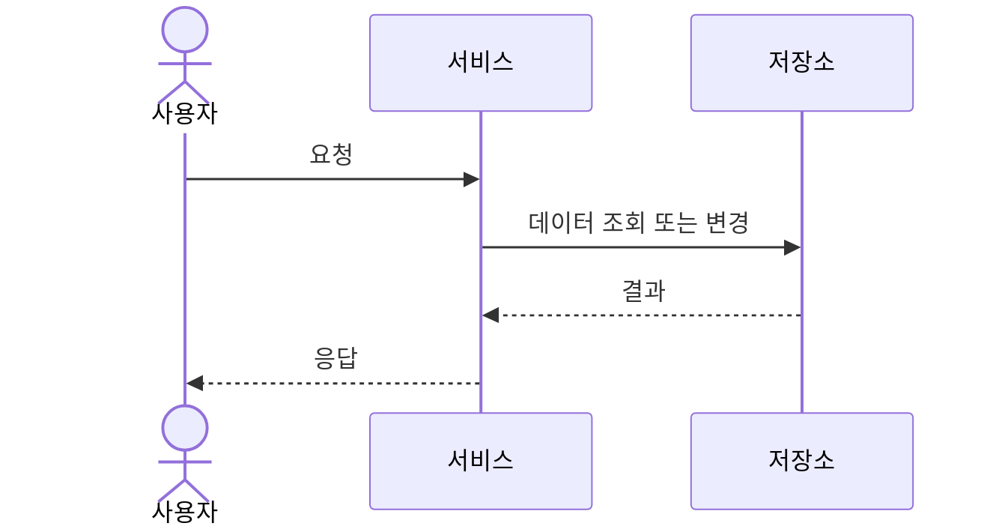

# 실행 흐름

## 문서 목적

정적인 구성 요소 목록만으로 알기 어려운 핵심 시나리오의 호출 순서, 상태 변화, 오류와 복구 동작을 설명합니다.

## 언제 수정하는가

- 핵심 시나리오의 처리 순서가 바뀔 때
- 재시도, 시간 초과, 중복 처리 또는 트랜잭션 경계가 바뀔 때
- 새로운 비동기 흐름이나 중요한 실패 경로가 생길 때

## 작성할 내용

- 정상 흐름과 중요한 오류 흐름
- 동기·비동기 경계와 상태 변화
- 시간 초과, 재시도, 멱등성과 보상 처리
- 트랜잭션과 일관성 경계

## 최소 예제

## 오류와 복구

- 시간 초과, 재시도, 중복 요청 처리 방식을 작성합니다.
- 실패가 사용자와 운영자에게 어떻게 표시되는지 작성합니다.

## 일관성과 트랜잭션

트랜잭션 경계와 최종 일관성이 허용되는 구간을 작성합니다.

## 관련 문서

- [구성 요소](building-blocks.md)
- [공통 개념](crosscutting-concepts.md)
- [API 명세](../specs/api/README.md)
- [이벤트 명세](../specs/events/README.md)
- [운영 안내](../operations/README.md)
