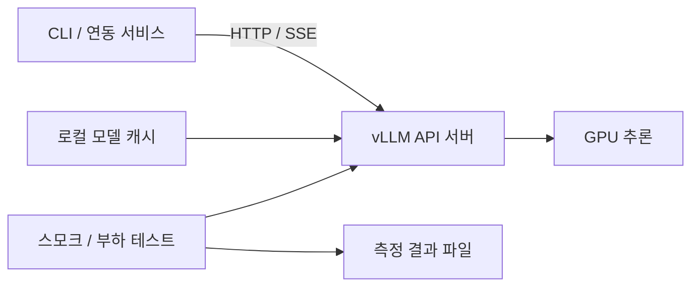

# RFC-0001: 로컬 vLLM 서빙 환경 구축

## 요약과 현재 상태

- 제안: 공식 vLLM 서버와 Docker Compose를 중심으로 단일 모델 API 실험 환경 구축
- 사용자 결과와 인수 조건: [REQ-LOCAL-001](../requirements/REQ-LOCAL-001.md)
- 현재 저장소: 문서 템플릿 중심, 실행 코드·배포 구성 미구현
- 기존 OpenAPI: 예시 계약이며 실제 vLLM 응답과 일치한다고 가정 금지
- GPU 확인 결과: 사용자 제공 3090 1개; RTX 3090 기본 24GB 구성으로 잠정 해석, 작업 환경 NVML 접근 차단으로 실제 메모리·드라이버 미검증
- 본 문서 상태: 구현 전 제안, 현재 실행 구조 또는 확정 결정 아님

## 제안 구조



- 배포: Linux + NVIDIA GPU를 잠정 기준으로 한 Docker Compose 서비스 1개
- 실행 이미지: 공식 `vllm/vllm-openai`, 호환성 검증한 버전 및 digest 고정
- 모델: Qwen3-8B를 첫 검증 후보로 선정 제안, 최종 모델과 revision은 실측 후 고정
- 호스트 공개 포트: 잠정 `127.0.0.1:18000`, 기존 서비스와 충돌 여부 확인 후 확정
- API: 모델 조회, Chat Completions, SSE 스트리밍부터 검증
- 클라이언트: Python HTTP 클라이언트, 추론 런타임과 별도 경량 의존성 관리
- 상태: 대화 이력은 요청의 messages로 전달, 서버 DB 도입은 후속 요구 발생 시 검토
- 프로세스: GPU 로딩과 요청 스케줄링은 vLLM이 관리; 별도 API worker에서 모델 중복 로딩 방지

vLLM은 대화 API를 제공하며, 대화 모델의 chat template 호환성 확인이 필요함. 공식 이미지로 서버 실행 가능. 근거: [서버 문서](https://docs.vllm.ai/en/latest/serving/online_serving/openai_compatible_server/), [Docker 문서](https://docs.vllm.ai/en/latest/deployment/docker/).

## 대안 비교

| 방식 | 장점 | 비용과 제약 | 제안 |
|---|---|---|---|
| 공식 서버 + Docker | 환경 격리, 배포 재현, 기본 API 활용 | GPU 컨테이너 환경 필요 | 1차 채택 제안 |
| Python 환경에서 vllm serve | 로컬 디버깅 편리 | PyTorch·CUDA 의존성 관리 필요 | 컨테이너 사용 곤란 시 대안 |
| FastAPI + 엔진 직접 통합 | 사용자 정의 처리 자유도 | 취소·스트리밍·프로세스 수명 관리 부담 | 특수 요구 확인 후 검토 |

## 모델과 메모리 선정 절차

1. GPU 종류·VRAM·드라이버·다른 프로세스 점유량 확인
2. 용도에 맞는 후보 1~2개의 vLLM 지원·chat template·라이선스 확인
3. 가중치 외 KV cache·활성값·런타임 여유를 포함해 메모리 예산 산정
4. 후보별 짧은 대화와 긴 입력을 실행해 실제 메모리·품질 확인
5. 모델·정밀도·컨텍스트·동시성 프로파일을 함께 고정

- 초기 탐색값: 컨텍스트 4,096 토큰, 출력 상한 512 토큰, 동시성 1부터 증가
- 입력 조건: chat template 적용 후 입력 토큰과 출력 예산의 합이 컨텍스트 이내
- 정밀도·양자화: GPU와 모델 지원 확인 후 결정, VRAM 용량만으로 확정 금지
- GPU 메모리 사용 비율: 공유 GPU 여부 확인 후 설정, 다른 서비스의 여유 메모리 보존
- 다운로드 용량·속도·접근 권한에 따른 준비 시간 변동 가능

## 3090 단일 GPU 초기 프로파일

| 항목 | 제안 | 검증 기준 |
|---|---|---|
| 기본 모델 | Qwen/Qwen3-8B | 한국어 대화 20건·코딩 10건 평가 |
| 비교 모델 | Qwen/Qwen2.5-Coder-7B-Instruct | 기본 모델의 코딩 품질이 부족할 때 교체 비교 |
| 정밀도 | BF16 우선 검증 | 실제 GPU·이미지 호환과 OOM 여부 확인 |
| 모델 병렬도 | GPU 1개, tensor parallel 1 | 단일 모델만 상주 |
| 컨텍스트 | 4,096 토큰부터 시작 | 메모리 여유 확인 후 8K 검토 |
| 출력 예산 | 대화 512, 코딩 최대 1,024 토큰 | 입력과 출력의 합이 컨텍스트 이내 |
| 동시성 | 1부터 시작, 2·4 비교 | 실패율·지연·메모리 측정 후 지원값 확정 |
| thinking | 초기 비활성화 | 스트리밍에 reasoning 내용 혼입 여부 검사 |

+- Qwen3의 thinking 전환과 vLLM 실행은 [공식 모델 카드](https://huggingface.co/Qwen/Qwen3-8B) 기준 검증
+- 코딩 비교 후보는 [Qwen2.5-Coder 모델 카드](https://huggingface.co/Qwen/Qwen2.5-Coder-7B-Instruct) 기준 검증
+- 위 후보는 최신 모델 순위 선정이 아닌 단일 GPU 기준선 확보 목적
+- 한국어 평가: 자연스러움·지시 준수·다중 턴 문맥을 각 샘플에 기록
+- 코딩 평가: 사용자 주력 언어 미정으로 Python 예제 잠정 사용, 작성·수정 과제 10건에 정답 테스트 준비
+- 생성 코드는 검토 후 네트워크·자격증명이 없는 격리 환경에서 시간 제한을 두고 테스트
+- 초기 품질 목표 제안: 한국어 20건 중 16건 이상 적합, 코딩 10건 중 7건 이상 테스트 통과; 미달 시 프롬프트와 후보 재검토

## 구현 산출물 제안

아래 경로와 명령은 생성 예정이며 현재 실행 불가.

```text
docker/compose.yml          # vLLM 서비스, GPU·캐시·포트·상태 검사
configs/                   # 모델별 비밀 값 없는 실행 프로파일
src/client.py              # 대화·스트리밍 호출 예제
scripts/preflight.sh        # GPU·Docker·디스크·설정 점검
scripts/smoke.py            # 기본 API와 오류 검증
scripts/benchmark.py        # 동시성별 측정·결과 저장
tests/                     # 클라이언트 단위 및 실제 서버 통합 검증
.env.example               # 값 없는 설정 안내
.gitignore                 # 모델·캐시·토큰·측정 산출물 제외
pyproject.toml             # 클라이언트·검증 도구 의존성
Makefile                   # preflight/up/down/logs/smoke/bench
```

- 주요 설정: 이미지 버전, 모델 ID·revision, 모델 별칭, 포트, GPU ID, 컨텍스트 길이, 동시성, 메모리 사용 비율
- 비밀 설정: 모델 저장소 토큰과 API 키를 런타임 주입, 이미지·Git에 포함 금지
- 모델 변경: 프로파일 변경 후 명시적 재기동, 1차에서는 동적 모델 교체 미지원

## 구현 단계와 예상 공수

개발자 1명, 접근 가능한 GPU와 모델 확보 기준. 다운로드·드라이버 장애 해결 시간 별도.

| 단계 | 작업 | 완료 기준 | 예상 |
|---|---|---|---|
| 0 | 장비·용도 확인, 모델과 이미지 선정 | 환경 사전 점검 통과 | 0.5~1일 |
| 1 | Compose·캐시·설정·실행 명령 | 모델 로딩 후 첫 대화 성공 | 1일 |
| 2 | 클라이언트·스트리밍·오류 검증 | LOCAL-02~04 충족 | 1일 |
| 3 | 반복 부하·메모리·재시작 검증 | 지원 동시성과 성능 기준선 확보 | 1~2일 |
| 4 | README·계약·운영 절차 정리 | 문서 절차로 재현 가능 | 0.5~1일 |

- 1차 전체 예상: 약 4~6일
- 우선 시연: 환경 준비 후 약 1~2일 내 단일 요청 성공 목표
- 후속 확장 순서: 필요 시 웹 UI → 서비스 인증·라우팅 게이트웨이 → RAG·도구 호출 → 다중 GPU
- 후속 단계 착수 조건: 실제 용도와 1차 측정에서 드러난 필요성 확인

## 검증과 운영 계획

- GPU 없는 검사: 설정 검증, 클라이언트 타임아웃·SSE 파싱 테스트, 문서 링크 검사
- GPU 통합 검사: 실제 모델 응답, 스트리밍 첫 청크와 종료, 연결 취소 후 후속 추론
- 성능 검사: 워밍업 후 같은 입력·출력 토큰 조건으로 동시성 1·2·4, 각 100건
- 측정 재현 정보: GPU·드라이버·이미지·모델 revision·정밀도·입출력 토큰 수·서버 옵션
- 준비 상태: 모델 로딩 중에는 추론 가능으로 판정 금지; 기동 완료 후 스모크 실행
- 실패 처리: 모델 다운로드·chat template·OOM·포트 충돌을 구분해 진단 기록
- 복구: 검증된 이미지와 모델 프로파일로 재기동, 기존 캐시 보존
- 로그: 상태·시간·오류 중심, 프롬프트와 응답 본문 기본 기록 비활성화
- 네트워크: 1차 localhost 한정; LAN 공유 시 인증·접근 범위·TLS 별도 설계
- 외부 통신: 최초 이미지·모델 확보와 로컬 추론 단계를 구분; 완전 오프라인 요구 시 별도 검증

## 문서와 계약 전환

- 현재 템플릿을 구현 완료 상태로 표기하지 않음
- 방향 확정 후 구현 Task 작성 및 필요한 ADR 기록
- 실제 실행 구성에 맞춰 Architecture·Operations·README 갱신
- 고정한 서버 버전의 지원 API 중 사용 범위만 Spec에 명시, OpenAI API 전체 호환 주장 금지
- 기존 예시 `/health` JSON 계약은 실제 서버 응답 검증 후 교체

## 미결 사항과 검토 결과

- 사용자 확인 완료: 3090 1개, 한국어 대화·코딩; 다른 GPU 서비스와 동시 실행 여부는 미정
- 사용자 확인 대기: 모델 선호, 최대 입력 길이, 목표 동시 요청, 완전 오프라인 필요 여부
- 첫 후보: Qwen/Qwen3-8B; 미확정: 최종 모델·revision·이미지 버전·정밀도·지연 목표
- 검토 결과: 초안 작성, 구현 및 GPU 검증 미실행
