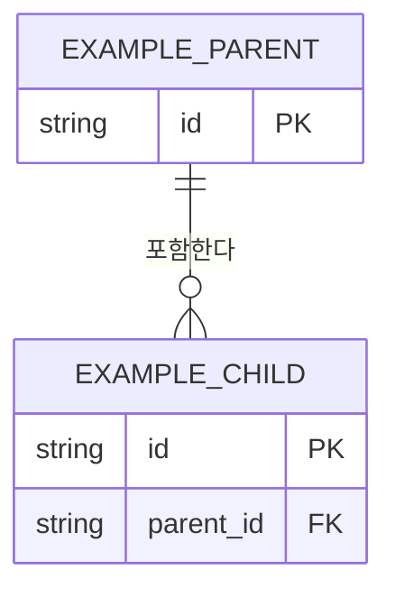

# 데이터 구조 개요

## 기준 위치

- 마이그레이션 또는 DDL 경로: 작성 필요
- 스키마 적용 명령: 작성 필요
- 스키마 검증 명령: 작성 필요

## 영역 관계

```mermaid
erDiagram
    EXAMPLE_PARENT ||--o{ EXAMPLE_CHILD : 포함한다
    EXAMPLE_PARENT {
        string id PK
    }
    EXAMPLE_CHILD {
        string id PK
        string parent_id FK
    }
```

위 예시는 실제 데이터 모델로 교체합니다.
