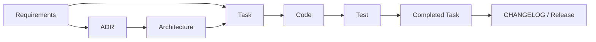

# 문서 안내

이 디렉터리는 프로젝트 지식의 기준 위치입니다. 같은 사실을 여러 문서에 복사하지 않고, 기준 문서를 링크합니다.

## 어디에서 무엇을 찾는가

| 질문 | 기준 위치 | 성격 |
|---|---|---|
| 무엇을 왜 만드는가? | `requirements/` | 승인된 요구사항 |
| 시스템은 현재 어떻게 구성되는가? | `architecture/` | 계속 갱신하는 현재 상태 |
| 왜 이 선택을 했는가? | `decisions/` | 결정 이력 |
| 추론 서버의 외부 계약은 무엇인가? | `specs/` | 기계 검증 가능한 계약 |
| 이번 변경에서 무엇을 하는가? | `tasks/` | 작업 계획과 이력 |
| 개발자는 어떻게 작업하는가? | `guides/` | 작업 절차 |
| 어떻게 실행하고 검증하는가? | `operations/` | 실행·검증 지식 |

## 핵심 문서

- [요구사항 안내](requirements/README.md)
- [아키텍처 안내](architecture/README.md)
- [결정 기록 안내](decisions/README.md)
- [작업 문서 안내](tasks/README.md)
- [개발 환경 안내](guides/development.md)
- [테스트 안내](guides/testing.md)
- [추론 API 계약](specs/inference-api.md)
- [운영 안내](operations/README.md)
- [문서 운영 정책](DOCS_GOVERNANCE.md)
- [용어집](glossary.md)

## 새 개발자가 읽는 순서

```text
저장소 README → Requirements → Architecture → ADR → Specs → Active Tasks → Guides → Operations
```

1. 저장소 [README](../README.md)에서 목적과 실행 방법을 확인합니다.
2. [Requirements](requirements/README.md)에서 무엇을 왜 만드는지 확인합니다.
3. [Architecture](architecture/README.md)에서 현재 구조와 제약을 이해합니다.
4. [ADR](decisions/README.md)에서 중요한 선택의 이유를 확인합니다.
5. [추론 API 계약](specs/inference-api.md)에서 구현이 따라야 하는 계약을 확인합니다.
6. [Active Tasks](tasks/README.md)에서 진행 중인 변경을 확인합니다.
7. 개발·테스트·릴리스 [Guides](guides/development.md)를 따릅니다.
8. 실행·검증 절차는 [Operations](operations/README.md)를 확인합니다.

## AI Agent가 읽고 작업하는 순서

AI Agent는 먼저 저장소 루트의 [AGENTS.md](../AGENTS.md)를 읽고, 관련 Requirement → Architecture → ADR → Spec → Active Task 순으로 확인합니다. 이후 Task 필요 여부를 판단하고 구현·검증·진행 기록·기준 문서 갱신·완료 이동 순서를 따릅니다.

개별 요청 형식은 [AI 작업 요청 템플릿](AI_AGENT_PROMPT_TEMPLATE.md)을 기준으로 합니다.

## 문서 간 관계



ADR은 조건에 해당할 때만 사용합니다. 생략 기준은 [문서 운영 정책](DOCS_GOVERNANCE.md)을 따릅니다.

## 문서 작성 여부 판단

| 변경 | 필요한 문서 |
|---|---|
| 짧고 국소적인 수정 | 기존 문서 영향 확인, 별도 문서 생략 가능 |
| 새로운 사용자 결과 또는 성공 조건 | Requirement, 필요하면 Task |
| 중요한 아키텍처 결정 | ADR → Architecture → Task |
| 현재 구조 변경 | Architecture와 Task |
| 여러 파일·모듈을 횡단하는 작업 | Task |

새 문서를 만들기 전에 같은 책임의 문서가 이미 있는지 확인합니다. 파일 수를 채우기 위해 문서를 만들지 않으며, 상세 판단표는 [문서 운영 정책](DOCS_GOVERNANCE.md)에 둡니다.

## 상태 표시

문서 상단 메타데이터에는 가능한 경우 `초안`, `검토 중`, `승인`, `현재`, `대체됨`, `폐기` 중 하나를 사용합니다. 문서 소유자와 마지막 검토일도 함께 기록합니다.

## 이 저장소의 티어

standard 티어에 **`specs/`와 `operations/` 두 모듈만** 추가해 사용합니다.

- `specs/`: 추론 서버의 OpenAI 호환 HTTP 계약 한 문서(`inference-api.md`). API/이벤트/DB 명세 하위 구조는 두지 않습니다.
- `operations/`: 로컬 실행·검증 지식(baseline 측정, OpenCode 연동, tool calling 호환성). 배포·모니터링·장애 대응·런북은 해당 사항이 없어 두지 않습니다.

RFC는 사용하지 않습니다. 다른 모듈이 필요해지면 원본 템플릿 저장소에서 가져옵니다.

```bash
/home/joon/code/project-sample/scripts/add-module.sh . rfcs
```

가져온 뒤 이 문서의 표와 루트 `AGENTS.md`에 항목을 추가합니다.
