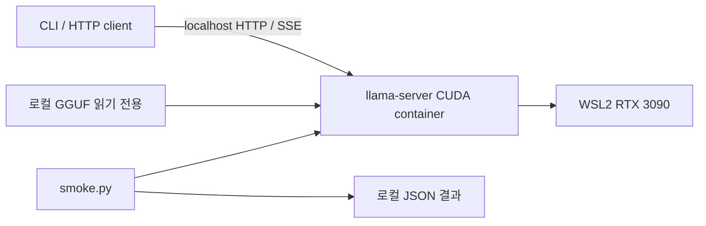

# LocalForge baseline 실행 구조

- 구성 파일: `.env.example` 기본값과 개인 `.env` 덮어쓰기
- Runtime 소스·빌드 결과·모델·측정 파일: Git 제외 `.local/`
- 서버 소유권: `localforge-baseline` 컨테이너 1개, GPU 0·모델 1개·parallel 1
- API 경계: [inference API](../specs/inference-api.md)
- 프로세스·GPU 초기화 책임: llama-server, 클라이언트에서 모델 로딩 없음
- 외부 접속: 이번 단계 미구현, 호스트 localhost 한정
- 재현성과 재기동: [실행 안내](../../README.md)
- 상태: CUDA 빌드·GPU offload·일반/스트리밍 API·재기동 검증 완료
- 측정 조건과 한계: [검증 결과](../operations/baseline-results.md)
